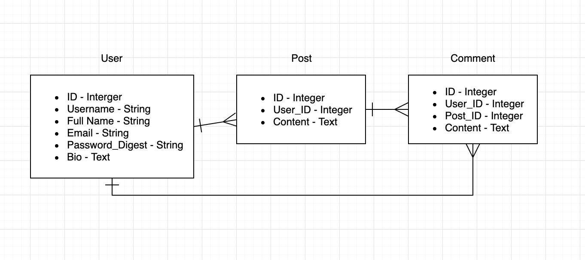
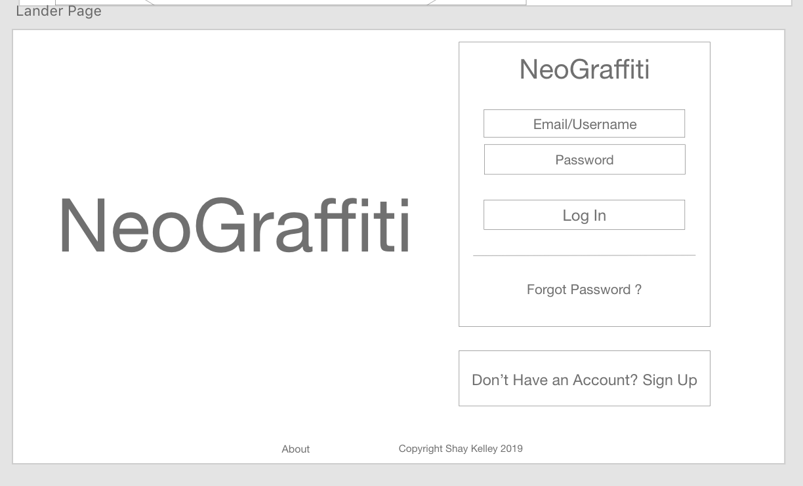
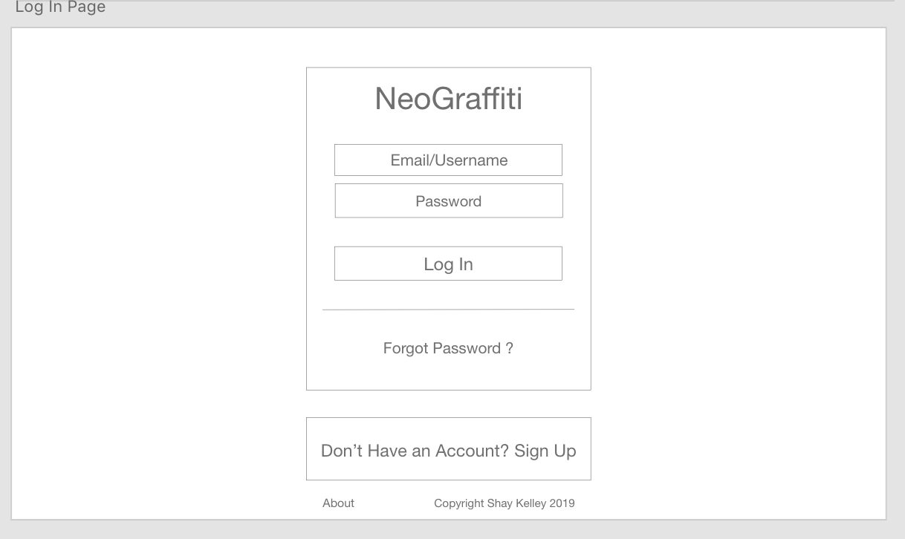
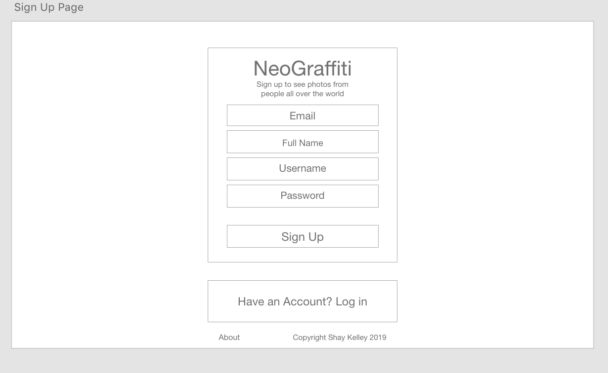
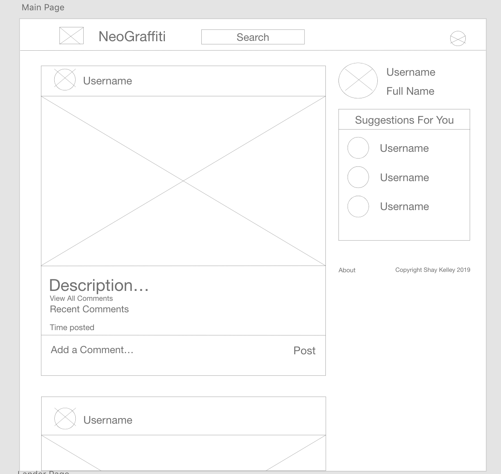
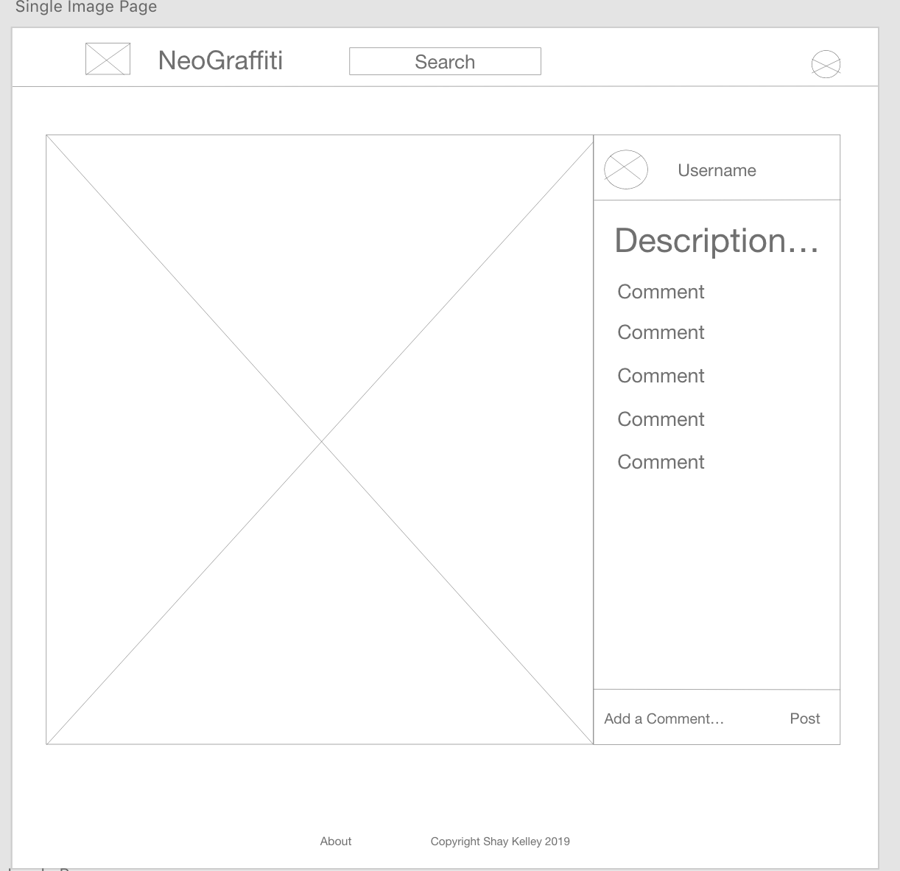
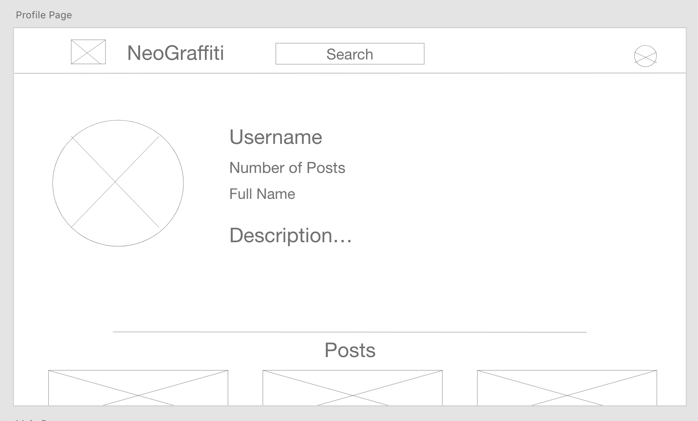
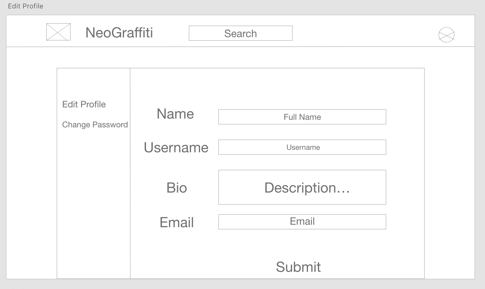
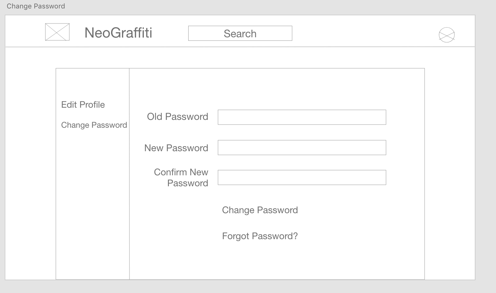

# NeoGraffiti

## Project Description

NeoGraffiti is an app that users can use to post pictures of art around the world in an more urban environment such as graffiti or street art. 

## Challenges

* Auth
* Post MVP
* CSS

## MVP

* Create User
* Edit and Delete User
* View Other Users
* View All Posts Regardless of User
* View, Create, Edit, and Delete Posts
* View, Create, Edit, and Delete Comments

## Post MVP

* Send Automatic Emails
* Forget Password
* Search Bar
* Nicer Upload Picture
* Animations

## Feature List

* Auth - Register, Login and Logout
* User Profile - Add Posts and Edit Profile
* Main Page - View All Posts
* Posts - Edit and Delete, Add Comments
* Comments - Edit and Delete

## Entity Relationship Diagram (ERD)

## Wireframes

## React Component Heirarchy

* Header
* Lander
* Login Page
* Signup Page
* Main Page
* Single Image Page
* Profile Page
* Edit Profile
* Change Password
* Footer

## API Endpoint Documentations

* /users
* /users/:user_id
* /users/:user_id/posts
* /users/:user_id/posts/:post_id
* /posts
* /posts/:post_id
* /posts/:post_id/comments

## List Dependencies

* React
  * Axios
  * React-Router-Dom

* Rails
  * JWT
  * BCrypt

## Timeframes